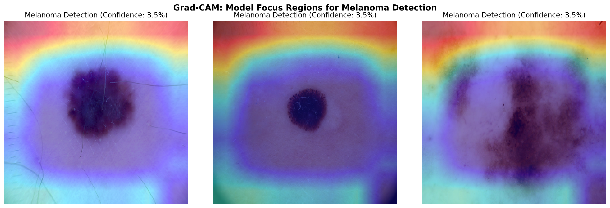

# Skin Lesion Classification with Deep Learning

**Detecting Melanoma Using Transfer Learning and Interpretable AI**


*Grad-CAM heatmaps showing model focus regions for melanoma detection. Warmer colors indicate regions of higher diagnostic relevance.*

---

## Overview

Skin cancer is the most common cancer in the United States, with melanoma accounting for the majority of skin cancer deaths. Early detection through visual inspection dramatically improves survival rates, yet diagnostic accuracy varies widely among clinicians.

This project builds a deep learning image classifier to distinguish between 7 types of skin lesions using dermoscopy images from the HAM10000 dataset. The model uses **transfer learning** with EfficientNet-B0 (pre-trained on ImageNet) and includes **Grad-CAM interpretability** to visualize what regions of each image drive the model's predictions.

## Key Results

| Metric | Baseline CNN | EfficientNet-B0 (Transfer Learning) |
|--------|-------------|-------------------------------------|
| Test Accuracy | 42.7% | **62.4%** |
| Macro ROC-AUC | 0.736 | **0.925** |
| Melanoma Recall | — | **59.9%** |
| Parameters | 4,961,479 | 4,385,450 |

**Macro ROC-AUC of 0.925** indicates strong discriminative ability across all 7 lesion types. Test accuracy (62.4%) reflects a deliberate tradeoff: class weights penalize misclassification of rare but dangerous lesions (melanoma, basal cell carcinoma) at the cost of majority-class accuracy. In a clinical screening context, catching a melanoma matters more than correctly labeling every benign mole.

### Per-Class ROC-AUC

| Lesion Type | ROC-AUC |
|-------------|---------|
| Actinic keratoses | 0.963 |
| Basal cell carcinoma | 0.961 |
| Benign keratosis | 0.898 |
| Dermatofibroma | 0.910 |
| Melanoma | 0.824 |
| Melanocytic nevi | 0.939 |
| Vascular lesions | 0.975 |

## Technical Approach

### Dataset

The [HAM10000 dataset](https://www.kaggle.com/datasets/kmader/skin-cancer-mnist-ham10000) contains 10,015 dermoscopy images across 7 diagnostic categories. The dataset is heavily imbalanced, with melanocytic nevi comprising ~67% of all images.

### Architecture

**EfficientNet-B0** with a custom classification head, trained using a two-stage transfer learning strategy:

1. **Stage 1 (Feature Extraction):** Froze all EfficientNet layers. Trained only the classification head (GlobalAveragePooling, BatchNormalization, Dense layers) for 15 epochs. Best validation accuracy: 63.6%.

2. **Stage 2 (Fine-Tuning):** Unfroze the top ~20% of EfficientNet layers (layers 190+). Trained end-to-end with a reduced learning rate (1e-4) for 20 epochs. Best validation accuracy: 66.2%.

### Handling Class Imbalance

- **Balanced class weights** computed from training distribution, penalizing misclassification of rare classes proportionally.
- **Data augmentation** on training images: rotation, flips, zoom, brightness variation, and shear transforms.

### Interpretability

**Gradient-weighted Class Activation Mapping (Grad-CAM)** generates heatmaps highlighting which image regions most influenced each prediction. This is critical in medical imaging for building clinician trust and validating that the model focuses on diagnostically relevant features rather than artifacts.

## Preprocessing Note

EfficientNet-B0 includes built-in preprocessing that expects raw pixel values in [0, 255]. An earlier version of this project applied `rescale=1./255` in the data generators, which double-scaled the inputs and collapsed model performance to ~11% accuracy. Removing the redundant rescaling resolved the issue. The baseline CNN, which has no built-in preprocessing, uses a `Rescaling(1./255)` layer instead.

## Repository Structure

```
├── ISIC_Skin_Lesion_Classification.ipynb   # Full notebook (Colab-ready)
├── README.md
└── results/
    ├── hero_gradcam_melanoma.png            # Grad-CAM hero image
    ├── gradcam_grid.png                     # Grad-CAM across all 7 classes
    ├── class_distribution.png               # Class imbalance visualization
    ├── confusion_matrix.png                 # Test set confusion matrix
    ├── roc_curves.png                       # Per-class ROC curves
    ├── precision_recall_curves.png          # Per-class PR curves
    ├── training_history.png                 # Loss/accuracy across both stages
    ├── sample_images.png                    # Sample dermoscopy images by class
    ├── demographics.png                     # Patient age/sex/location distributions
    └── per_class_metrics.csv                # Exportable results table
```

## Reproducibility

To run this notebook:

1. **Kaggle account:** Create a free account at [kaggle.com](https://www.kaggle.com) and generate an API token (Settings > API Tokens > Generate New Token).
2. **Google Colab:** Open the notebook in Colab and set the runtime to **T4 GPU** (Runtime > Change runtime type).
3. **Google Drive:** The notebook mounts Drive for checkpoint persistence. If a Colab session disconnects, progress is preserved.

Estimated runtime on Colab free tier (T4 GPU): ~40 minutes.

## Tools and Libraries

Python, TensorFlow/Keras, EfficientNet-B0, scikit-learn, OpenCV, Matplotlib, Seaborn, Pandas, NumPy

## Limitations

- HAM10000 is a curated research dataset. Real-world dermoscopy images contain more noise, lighting variation, and hair artifacts.
- Class imbalance persists despite weighting, with melanocytic nevi still dominating predictions.
- This is a research prototype, not a clinical diagnostic tool. Deployment would require FDA oversight and clinical validation.

## Future Work

- Binary framing (malignant vs. benign) for simpler threshold tuning and higher clinical utility
- Ensemble methods combining EfficientNet with ResNet or DenseNet
- Threshold optimization to maximize melanoma sensitivity at acceptable specificity levels
- Fairness analysis across patient demographics (age, sex, skin tone)
- TF Lite conversion for mobile deployment

## Author

**John Apel, Jr.**
M.S. Applied Data Science, Syracuse University

[Portfolio](https://johnapeljr.github.io) | [LinkedIn](https://linkedin.com/in/john-apel-76700154) | [GitHub](https://github.com/JohnApelJr)

## License

This project is for educational and research purposes. The HAM10000 dataset is licensed under [CC BY-NC-SA 4.0](https://creativecommons.org/licenses/by-nc-sa/4.0/).
